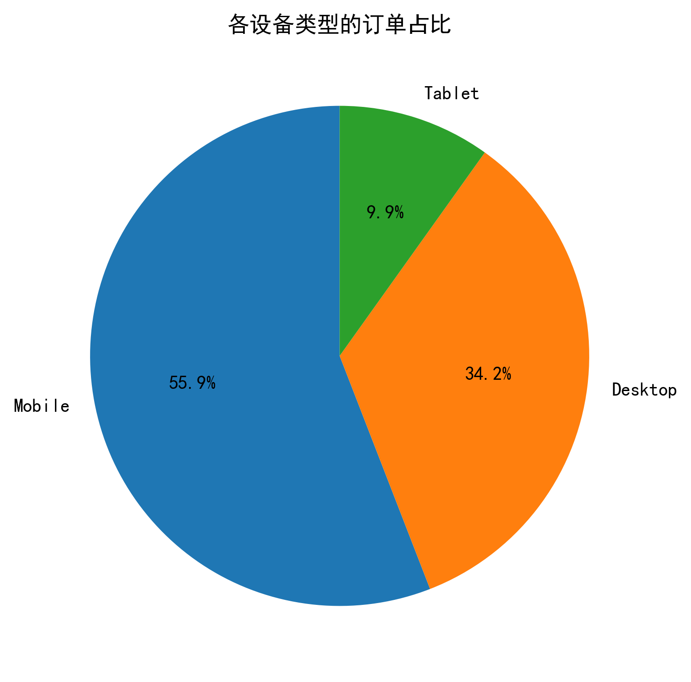
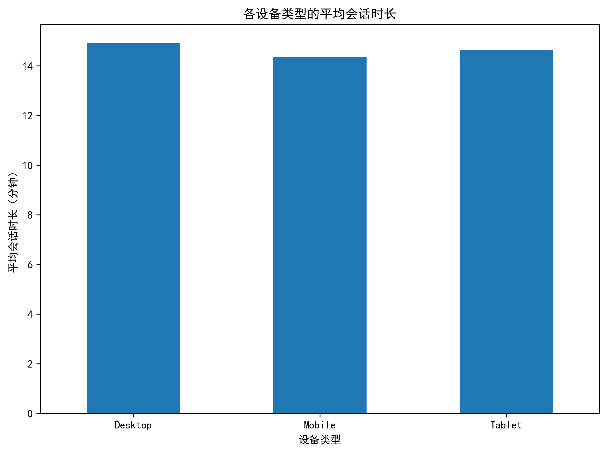
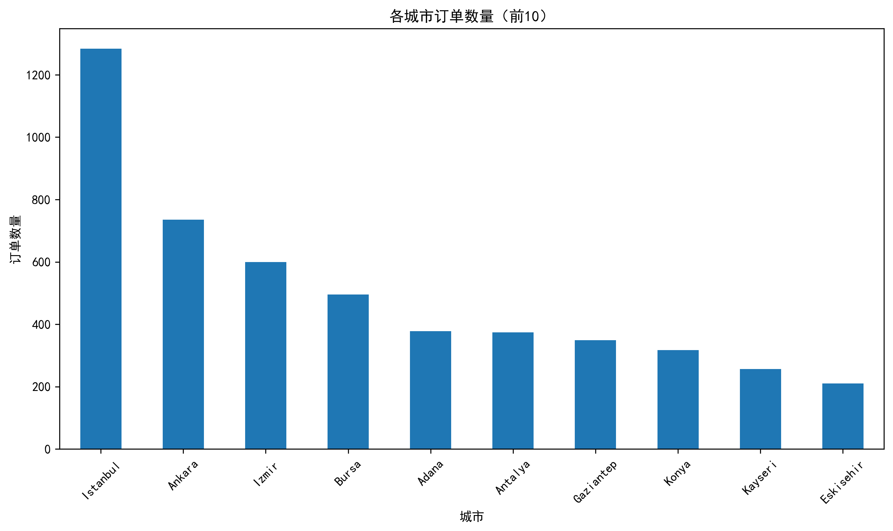
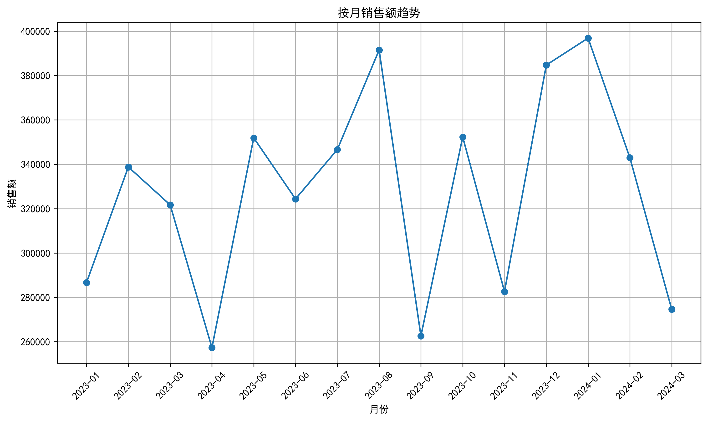
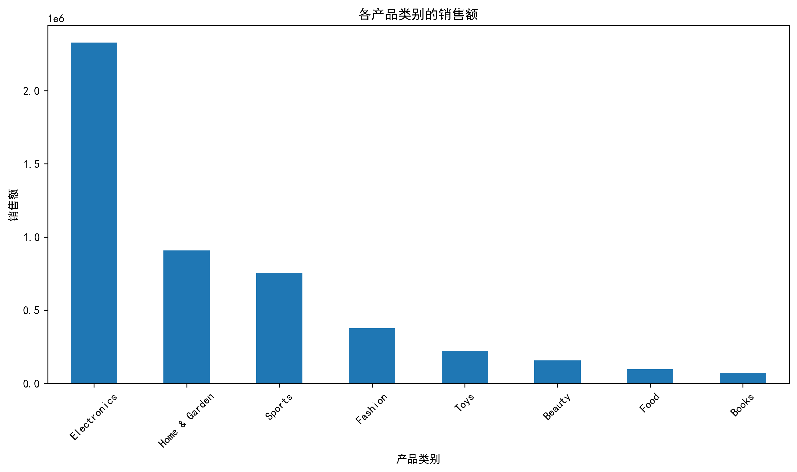
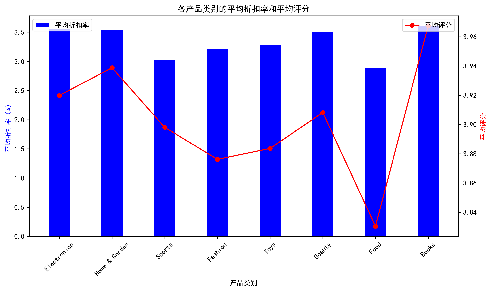
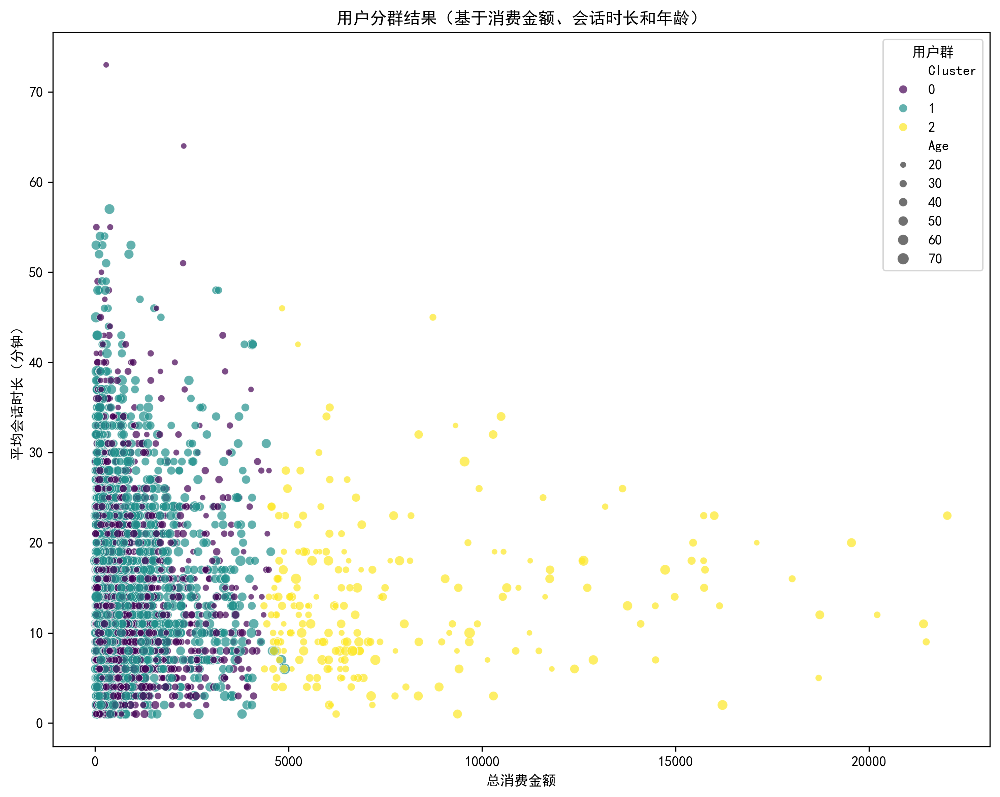

# 电商用户行为与销售分析实验报告

## 一、实验目的

1. 分析电商平台的用户行为与销售趋势
2. 优化电商平台的运营策略
3. 掌握数据清洗、分析和可视化的方法
4. 学习使用K-Means进行用户分群

## 二、实验数据

### 1. 数据来源
实验使用的是电商用户行为数据集 `ecommerce_customer_behavior_dataset.csv`，包含5000条订单记录。

### 2. 数据字段
- `Order_ID`：订单ID
- `Customer_ID`：客户ID
- `Date`：订单日期
- `Age`：客户年龄
- `Gender`：客户性别
- `City`：客户所在城市
- `Product_Category`：产品类别
- `Unit_Price`：单价
- `Quantity`：数量
- `Discount_Amount`：折扣金额
- `Total_Amount`：总金额
- `Payment_Method`：支付方式
- `Device_Type`：设备类型
- `Session_Duration_Minutes`：会话时长
- `Pages_Viewed`：浏览页数
- `Is_Returning_Customer`：是否回头客
- `Delivery_Time_Days`：配送时间
- `Customer_Rating`：客户评分

## 三、实验步骤

### 1. 数据预处理
- 编写Python脚本 `data_preprocessing.py` 进行数据清洗
- 处理异常值：过滤年龄>75岁的记录
- 数据类型转换：将日期字段转换为日期类型
- 保存清洗后的数据到 `cleaned_ecommerce_data.csv`

**截图位置**：插入 `terminal_output_step_by_step.txt` 中「步骤1：数据预处理」的终端输出截图

### 2. 用户行为分析
- 分析各设备类型的订单占比和平均会话时长
- 计算回头客比例
- 统计各城市订单数量

**截图位置**：插入 `terminal_output_step_by_step.txt` 中「步骤2：用户行为分析」的终端输出截图

### 3. 销售趋势分析
- 按月统计销售额趋势
- 分析各产品类别的销售额、折扣率和平均评分

**截图位置**：插入 `terminal_output_step_by_step.txt` 中「步骤3：销售趋势分析」的终端输出截图

### 4. 用户分群与推荐策略
- 使用K-Means对用户进行分群（基于年龄、消费金额、会话时长）
- 提出基于分群结果的个性化推荐策略

**截图位置**：插入 `terminal_output_step_by_step.txt` 中「步骤4：用户分群与推荐策略」的终端输出截图

### 5. 可视化
- 使用Matplotlib和Seaborn生成可视化图表
- 保存图表到 `visualizations` 目录

**截图位置**：插入 `terminal_output_step_by_step.txt` 中「步骤5：可视化」的终端输出截图

## 四、实验结果与分析

### 1. 用户行为分析结果

#### 1.1 设备类型分析
| 设备类型 | 订单占比 | 平均会话时长（分钟） |
|----------|----------|----------------------|
| Mobile   | 55.90%   | 14.35                |
| Desktop  | 34.22%   | 14.92                |
| Tablet   | 9.88%    | 14.63                |

**可视化图表**：
- 图1：各设备类型订单占比饼图
  
- 图2：各设备类型平均会话时长柱状图
  

**分析**：移动端订单占比最高，说明用户更倾向于使用手机进行购物，但各设备类型的会话时长差异不大。

#### 1.2 回头客分析
- 回头客比例：59.80%

**分析**：平台用户粘性较好，超过一半的用户会再次购买。

#### 1.3 城市分布分析
| 城市       | 订单数量 |
|------------|----------|
| Istanbul   | 1284     |
| Ankara     | 735      |
| Izmir      | 600      |
| Bursa      | 496      |
| Adana      | 378      |

**可视化图表**：
- 图3：各城市订单数量柱状图
  

**分析**：订单主要集中在大城市，尤其是Istanbul，应重点关注这些城市的用户需求。

### 2. 销售趋势分析结果

#### 2.1 按月销售额趋势
| 月份     | 销售额       |
|----------|--------------|
| 2024-01  | 396,874.92   |
| 2023-12  | 384,717.52   |
| 2023-08  | 391,505.89   |
| 2023-05  | 351,902.03   |
| 2023-10  | 352,286.61   |

**可视化图表**：
- 图4：按月销售额趋势折线图
  

**分析**：销售额呈现波动上升趋势，年末和年初销售额较高，可能与节假日购物季有关。

#### 2.2 产品类别分析
| 产品类别       | 销售额       | 平均折扣率 | 平均评分 |
|----------------|--------------|------------|----------|
| Electronics    | 2,328,806.81 | 3.56%      | 3.92     |
| Home & Garden  | 908,348.86   | 3.53%      | 3.94     |
| Sports         | 754,563.56   | 3.02%      | 3.90     |
| Fashion        | 375,214.93   | 3.21%      | 3.88     |
| Toys           | 223,142.48   | 3.29%      | 3.88     |

**可视化图表**：
- 图5：各产品类别销售额柱状图
  
- 图6：各产品类别折扣率和评分双轴图
  

**分析**：电子产品销售额最高，各类别平均评分都在3.8-4.0之间，用户满意度较高。

### 3. 用户分群结果

使用K-Means将用户分为3个群体：

| 用户群 | 平均年龄 | 平均消费金额 | 平均会话时长 | 用户数量 | 特征描述       |
|--------|----------|--------------|--------------|----------|----------------|
| 1      | 26.5岁   | 629.3        | 13.6分钟     | 2496     | 年轻低消费用户 |
| 2      | 44.5岁   | 692.9        | 15.7分钟     | 2283     | 中年普通消费   |
| 3      | 34.1岁   | 8009.9       | 13.8分钟     | 221      | 年轻高消费用户 |

**可视化图表**：
- 图7：用户分群散点图
  

**分析**：通过K-Means聚类，我们将用户分为三个不同特征的群体，每个群体具有不同的消费习惯和行为特征，可以针对不同群体制定个性化的推荐策略。

## 五、结论与建议

### 1. 主要结论

1. **用户行为特征**：移动端是主要购物渠道，回头客比例较高，用户粘性较好
2. **销售趋势**：销售额呈现波动上升趋势，电子产品是主要销售类别
3. **用户分群**：用户可以分为年轻低消费、中年普通消费和年轻高消费三个群体

### 2. 运营策略建议

#### 2.1 设备优化
- 重点优化移动端用户体验，提高移动端转化率
- 确保网站在不同设备上都有良好的适配

#### 2.2 用户粘性提升
- 针对回头客推出专属优惠活动，进一步提高用户复购率
- 完善会员体系，增加会员权益

#### 2.3 城市运营
- 针对订单量大的城市（如Istanbul）推出本地化营销活动
- 加强对中小城市的市场推广

#### 2.4 产品策略
- 继续重点推广电子产品，同时关注其他类别产品的销售
- 根据产品评分调整产品策略，优化低评分产品

#### 2.5 个性化推荐
- **用户群1**（年轻低消费）：推荐性价比产品，推出限时折扣活动
- **用户群2**（中年普通消费）：推荐热门产品，使用个性化推荐算法
- **用户群3**（年轻高消费）：推荐高端产品，提供个性化定制服务

#### 2.6 季节性营销
- 根据月度销售趋势，在销售额高峰期（年末、年初）提前策划营销活动
- 在销售额低谷期推出促销活动，刺激消费

## 六、实验总结

本次实验通过对电商用户行为数据的分析，深入了解了用户行为特征和销售趋势，并使用K-Means进行了用户分群。实验结果为电商平台的运营策略优化提供了数据支持，同时也掌握了数据清洗、分析和可视化的方法。

在实验过程中，我们遇到了数据库连接问题，但通过调整方案，使用CSV文件进行分析，最终完成了所有实验任务。实验结果表明，数据驱动的运营策略能够帮助电商平台更好地了解用户需求，提高销售额和用户满意度。

## 七、附录

### 1. 实验代码
- `data_preprocessing.py`：数据预处理脚本
- `data_analysis.py`：数据分析和可视化脚本

### 2. 可视化图表
所有图表保存在 `visualizations` 目录中，包括：
- `device_order_ratio.png`：各设备类型订单占比饼图
- `device_session_duration.png`：各设备类型平均会话时长柱状图
- `city_order_count.png`：各城市订单数量柱状图
- `monthly_sales.png`：按月销售额趋势折线图
- `category_sales.png`：各产品类别销售额柱状图
- `category_discount_rating.png`：各产品类别折扣率和评分双轴图
- `user_clusters.png`：用户分群散点图

### 3. 数据文件
- `ecommerce_customer_behavior_dataset.csv`：原始数据
- `cleaned_ecommerce_data.csv`：清洗后的数据

## 八、参考文献

1. Python数据分析与可视化，机械工业出版社
2. 机器学习实战，人民邮电出版社
3. 电商数据分析实战，电子工业出版社
